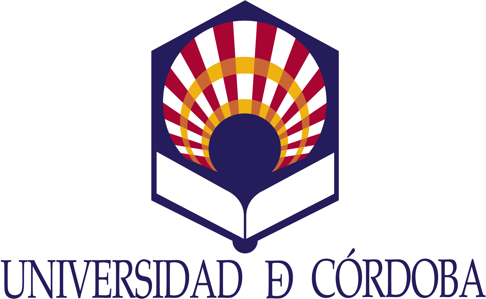
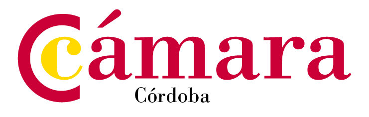

## Contacto

#### _Coordinadora: María Isabel Sánchez Rodríguez_
#### Profesor: José Rafael Caro Barrera

**Despacho:** Campus Universitario de Rabanales, Edif. C2 - 2a Planta

**Email:** jrcaro@uco.es

### Horas de Consulta y Tutorías

Estoy disponible siempre en el correo electrónico y contesto con la máxima rapidez que puedo, inclusive durante el periodo vacacional, que comprende desde el 23 de Diciembre hasta el 6 de enero, por lo que fuera de este periodo, mis horas de tutorías son:

#### Martes de 11:30-13:00
#### Jueves de 10:30-12:00

O previa cita a cualquier otro día y hora. Se tiene completa libertad para contactar a cualquier día y hora y cualquier cita será bienvenida.

### Forum del Curso

Aparte de resolver cualquier tipo de duda tanto en clase como por correo siempre, puede ser que alguna de las dudas sea de interés general. Para preguntas de este tipo, como aclaraciones del curso o preguntas conceptuales, suelen funcionar bien y ser de utilidad los foros de discusión, ya que además promueve la participación activa de los estudiantes, por lo que se invita a utilizar el [foro de discusión de cada bloque](https://moodle.uco.es/m2021/course/view.php?id=3378#section-1).


## Información y Fechas del Curso

**Lugar:** Sistema de docencia On-line Plataforma Cisco Webex de la Universidad de Córdoba. [Enlace](https//ucordoba.webex.com/meet/master.mba)

* Se ha organizado el curso en los siguientes módulos semanales.

```{r table2, echo=FALSE, message=FALSE, warnings=FALSE, results='asis'}
tabl <- "  ### Calendario de Fechas
| Semana I       | Martes, 15 diciembre        | 18:00-20:00  |
|---------------|:-------------:|------:|
| | Jueves, 17 diciembre        | 18:00-20:00  |
| **Semana II**       | **Martes, 22 diciembre**        | **18:00-20:00**  |
| | Jueves, 7 enero        | 18:00-20:00  |
| **Semana III**       | **Martes, 12 enero**        | **18:00-20:00**  |
| | Jueves, 14 enero        | 18:00-20:00  |
| **Semana IV**       | **Martes, 19 enero**        | **18:00-20:00**  |
| | Jueves, 21 enero        | 18:00-20:00  |
| **Semana V**       | **Martes, 26 enero**        | **18:00-20:00**  |
| | Jueves, 28 enero        | 18:00-20:00  |
| **Semana VI**       | **Martes, 02 febrero**        | **18:00-20:00**  |
| | Jueves, 04 febrero        | 18:00-20:00  |
| **Semana VII**       | **Martes, 9 febrero**        | **18:00-20:00**  |
| | Jueves,11 febrero        | 18:00-20:00  |
| **Examen Final** |  **Martes, 16 febrero**        |  |
"
cat(tabl) # output the table in a format good for HTML/PDF/docx conversion
```


### Objetivos

El curso se plantea como una introducción a la estadística empresarial de una forma práctica mediante el uso del software SPSS.

Al finalizar, se pretende que el estudiante sea capaz de:

* Analizar y comprender la estructura de los datos con los que se trabaja, su observación, visualización y representación, en un entorno empresarial.

* Analizar la información contenida en una muestra en un contexto económico y saber extrapolar dicha información a la población objeto de estudio. 

* Elaborar modelos y en el aprendizaje de técnicas que permiten realizar previsiones sobre fenómenos de carácter económico y empresarial.

* Realizar todo lo anterior desde un enfoque práctico con las herramientas informáticas adecuadas y adaptadas al entorno actual.


### Material y Libro de Texto

Aunque no hay un libro de texto específico para este curso en la guía docente se recomienda una bibliografía básica con objeto de apoyo; no obstante, se trabajará con material disponible en la plataforma y con recursos de libre acceso.

### Software

El software que utilizaremos en el curso es **SPSS** y está disponible en los servidores de la Universidad de Córdoba; aunque se puede acceder a él mediante Citrix de forma externa, se recomienda que el estudiante instale el software en su ordenador personal. 

## Organización de la Asignatura

La asignatura está organizadas en los siguientes bloques:

* #### Bloque I: Introducción a la Estadística y a SPSS

En este primer bloque sentaremos las bases del análisis estadístico, qué es y para qué se suele utilizar esta ciencia, las principales técnicas de análisis de datos a la vez que nos introduciremos en el manejo de _SPSS_.

* #### Bloque II:  Análisis y Descripción de Datos en la Empresa

En el segundo bloque ya nos adentraremos en el análisis de datos propiamente dicho, veremos cómo trabajar con un conjunto de datos bien fabricados por nosotros o importados en otro formato ajeno al entorno SPSS y los diferentes tipos de análisis descriptivo que podemos realizar con ellos en función de las necesidades que tengamos.

Al finalizar el _bloque 2_ se realizará el **Test de Autoevaluación o Caso Práctico I**, como parte de la evaluación continua, un test que consistirá en preguntas 

* #### Bloque III: De lo Particular a lo General: La Inferencia Estadística

Seguimos avanzando en nuestro recorrido por la estadística y a partir de una muestra, veremos cómo generar los modelos, inferencias y predicciones asociadas a los fenómenos que estemos analizando teniendo en cuenta la aleatoriedad de las observaciones para modelizar patrones en los datos y extraer conclusiones acerca de la población objeto de estudio.

El _bloque 3_ termina con el **Test de Autoevaluación o Caso Práctico II**.

* #### Bloque IV: Explicando el Comportamiento: Regresión y Diseño de Experimentos

Los modelos causales determinan la relación de dependencia entre variables. Aquí veremos cómo en numerosas situaciones prácticas una o varias variables influyen en los valores de otra u otras y su forma de analizarlas para explicar su comportamiento.

El _bloque 4_ culmina con el **Test de Autoevaluación o Caso Práctico III**.

* #### Bloque V: Relaciones entre Conjuntos de Variables: Análisis Multivariante

En el último bloque de la asignatura veremos algunas técnicas de análisis multivariante utilizadas cuando el análisis estadístico uni y bidimensional no se pueden aplicar,  estas técnicas se aplican en áreas muy diferentes y ayudan al analista o investigador a tomar decisiones óptimas en el contexto en el que se encuentre teniendo en cuenta la información disponible por el conjunto de datos analizado. En el ámbito que nos ocupa, las técnicas multivariantes son muy utilizadas en economía, seguros y servicios financieros.

El _bloque 5_ finaliza con el **Test de Autoevaluación o Caso Práctico IV**.

## Actividades y Tests de Autoevaluación

Al finalizar cada bloque habrá un _Test de Autoevaluación_ o _Actividad Práctica_ dependiendo de la materia que se haya visto, a modo de ir conformando la nota para el 50% de la evaluación continua. Normalmente se realizará en la hora de clase; si es un _test de autoevaluación_ se abrirá el test a una hora determinada, siempre dentro de la hora lectiva y se dará el suficiente tiempo como para que pueda ser completado. Si es una actividad práctica con SPSS, se abrirá una tarea para que se pueda subir el archivo con los resultados, con un periodo de gracia posterior a la finalización de la clase.

Se pretende que haya **4 actividades que formen la evaluación continua**, cada una con una ponderación del 25%.


## Evaluación
La nota estará compuesta por los siguientes instrumentos de evaluación:

- **50% Actividades Prácticas y/o Tests de Autoevaluación**, al finalizar los bloques:
  - Bloque II: 25%
  - Bloque III: 25%
  - Bloque IV: 25%
  - Bloque V: 25%
  
- **50% Examen Final**
 
## Código de Conducta

### Participación y Asistencia

No se exige la asistencia de forma obligatoria, sin embargo, se espera que el alumno permanezca en clase y concentrado hasta que haya terminado todas sus actividades y asignaciones.


### Diversidad e Inclusión

El objetivo es que todo el asistente se sienta cómodo durante el desarrollo de las clases. Si hay alguna forma de hacer que el curso sea más acogedor, por favor, no dude en preguntar.

En particular, si se tiene alguna discapacidad, se facilitará la accesibilidad a la clase.

### Trampas y Plagio.

El plagio, copia, proposición deshonesta de trampa o cualquier tipo de engaño de esta índole no está permitido. Cualquier indicio de esta situación otorgará una calificación de 0 en la tarea y una penalización en la calificación general.

### <sup>*</sup>_Cambios de Última Hora_

_Es posible que el esquema y plan del curso visto anteriormente pueda sufrir modificaciones y readaptaciones en función del grado de avance de la materia._

---

Organizado por:

{ width=15% }{ width=20% }